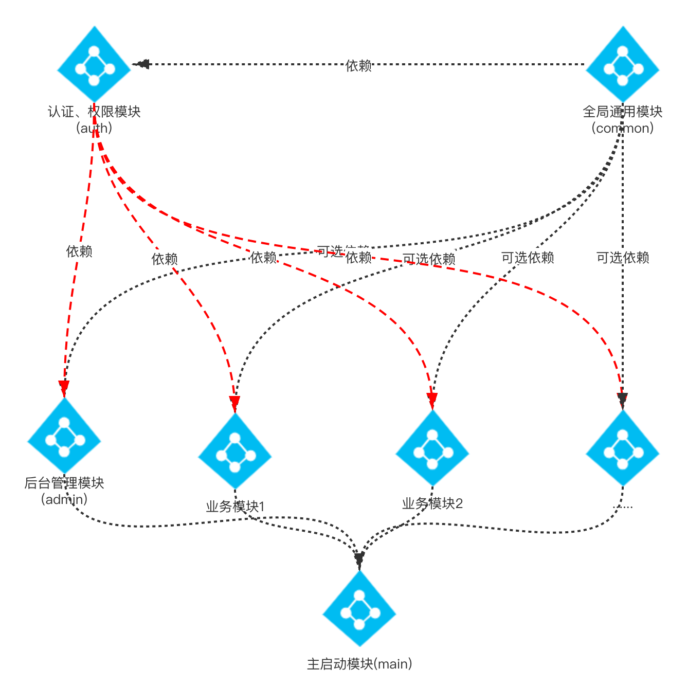

# polaris

#### 介绍
前后端分离、模块化的后端springboot项目，集成了shiro+jwt+redis

#### 软件架构
软件架构说明



#### 安装教程

1.  `git clone https://gitee.com/yooga/polaris.git`
2.  `Run PolarisMainApplication`

#### 新建moudle

1.  新建moudle后，在父模块的pom.xml中加入新建的子模块
2.  在 `PolarisMainApplication.class` 中添加`scanBasePackages` 路径
3.  子模块继承的父模块改为
    ```
    <parent>
        <groupId>com.unbiased</groupId>
        <artifactId>polaris</artifactId>
        <version>0.0.1-SNAPSHOT</version>
        <relativePath />
        <!-- lookup parent from repository -->
    </parent>
    ```
4. 子模块若有自己的配置文件，在main模块 `application.yml` 中激活 
    ```$xslt
    spring:
      profiles:
        active: dev,auth,common，xxxx
    ```
5. 子模块如果有权限控制的需要，子模块的pom文件必须引入 auth模块
    ```$xslt
    <dependencies>
        <dependency>
            <groupId>com.unbiased</groupId>
            <artifactId>polaris-auth</artifactId>
            <version>0.0.1-SNAPSHOT</version>
        </dependency>
    </dependencies>
    ```
6. 子模块可选引入common模块，该模块是一些公共的utils、service等，建议不在里边写业务controler接口


